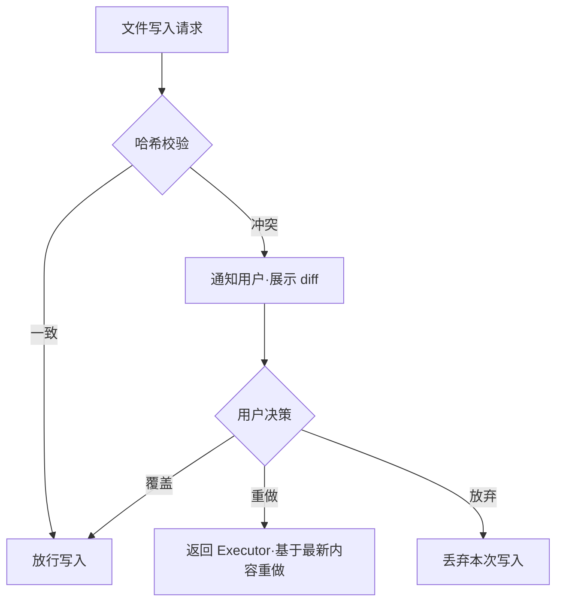
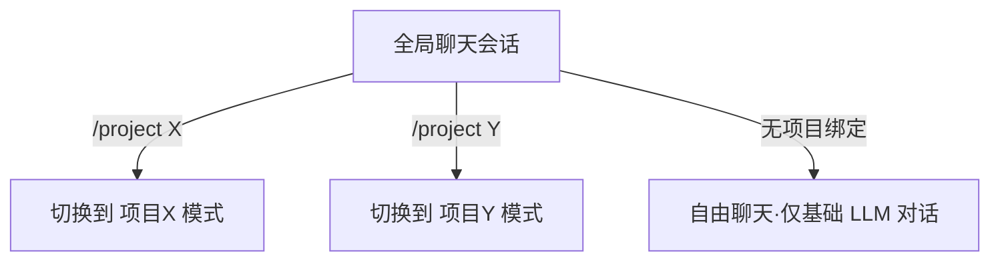
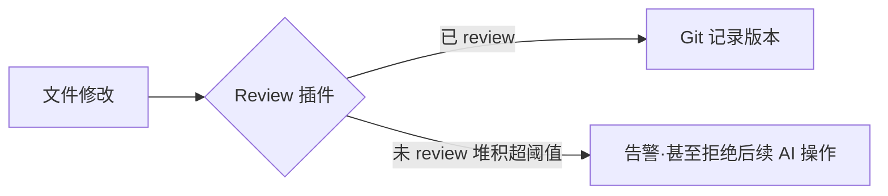

# NeuralSwarm/Code 官方插件设计

> 本文档画每个**官方插件**的"饼"——它做什么、绑哪个点、关键设计决策。
> 官方插件 = 标准库，native transport，每节点自带，但走与社区插件**完全相同**的注册流程，无架构特权。
> 接口契约见《插件接口设计》，分档与定位见《白皮书》第 11 章。

---

## 0. 总览

| 插件 | 绑定点 | 档位 | 一句话 |
|------|--------|------|--------|
| 朴素 LLM 调用 | `llm-prompt`→`llm-response` | 最小核 | 对接一个模型端点 |
| 基础工具 | `tool:file_read/file_write/shell` | 最小核 | 读写文件、跑命令 |
| 聊天面板 | `ui:` 主区 | 最小核 | 对话与结果渲染 |
| 记忆 | `llm-prompt` + `tool:remember` | 标准库 | 带标签的便签本 |
| Spec 注入 | `llm-prompt` | 标准库 | 注入项目规范 |
| 并发控制 | `tool-execute.before[file_write]` | 标准库 | 哈希冲突检测 + 通知 |
| 文件树/工作区视图 | `ui:sidebar` | 标准库 | 多项目工作区浏览 |
| 冲突弹窗 | `ui:dialog` | 标准库 | diff 对照 + 用户决策 |
| 令牌授权确认 | `ui:dialog` | 标准库 | 跨域请求授权 |
| 状态栏 | `ui:statusbar` | 标准库 | 项目/连接/节点状态 |
| 全局聊天 | `lifecycle` + `ui:toolbar` | 标准库 | 无项目绑定的自由对话 |
| 提交插件 | `tool-result.after` | 后期 | 自动 commit |
| Review 插件 | `tool-execute.before` | 后期 | 拦截未 review 修改 |

---

## 1. 朴素 LLM 调用（最小核）

挂 `llm-prompt`→`llm-response`。对接**一个**模型端点（OpenAI/Anthropic 兼容），发 prompt 拿 response，解析出文本或 toolcall。

**明确边界**：这是低级版，**不是融合 LLM**。不含多 provider、不含 fallback、不含跨节点 LLM 调度——那些是升级版（后期），与本插件挂在同一个点上，将来平滑替换，agent 闭环一行不改。

## 2. 基础工具（最小核）

挂 `tool:file_read` / `tool:file_write` / `tool:shell`。schema 符合 OpenAI/Anthropic 规范，路径为工作区相对路径（见《插件接口设计》第 5 节）。文件类工具碰 `project://` 资源，由内核路由到 Owner 原地执行。

## 3. 聊天面板（最小核）

挂 UI 主区。渲染消息流、流式输出、toolcall 折叠/展开、diff、输入框。遵循《前端设计规范》——排版驱动层次、去卡片化、四套主题 token。这是用户与 agent 闭环交互的入口。

## 4. 记忆插件（标准库）—— 带标签的便签本

**这是一个明确的反向设计决策**：记忆**不是**四层认知架构（L0-L3），**不是** RAG 向量库，**不是**自动记录。就是一个**带标签的便签本**，用户手动决定记什么。

> 自动记忆 = 自动污染。让用户决定什么值得记住。

| 特性 | 设计 |
|------|------|
| 存什么 | 用户手动 `/remember` 的内容 |
| 怎么存 | 本地文件 / SQLite，纯文本/Markdown + 标签 |
| 怎么用 | 下次对话开始时，挂 `llm-prompt` 检索相关记忆注入上下文 |
| 不做什么 | 不自动记录、不自动整理、不自动提升层级 |
| 同步 | 域级共享状态：写入 Gossip 广播全域，删除全域清除 |

```
- tag: neuralswarm-architecture
  content: "内核只有六机制，所有能力是绑在点上的 handler"
  created: 2026-06-30
```

两个绑点：`tool:remember`（用户触发写入）+ `llm-prompt`（对话开始时检索注入）。

## 5. Spec 注入插件（标准库）

挂 `llm-prompt`，注入项目规范，让 LLM 按项目约定干活。

| 特性 | 设计 |
|------|------|
| 规范来源 | `SKILLS.md`、`.neuralswarm/spec/`、项目根 `spec/` |
| 注入时机 | `llm-prompt` 点，排在上下文收集之后 |
| 注入方式 | **检索相关片段**注入 system prompt，不全量塞入 |
| 版本联动 | 跟随 Git 分支——切分支自动切 Spec |

## 6. 并发控制插件（标准库）

挂 `tool-execute.before`，`filter: [file_write]`，拦截文件写入做哈希校验。状态（文件哈希快照）绑 `project://X/.snapshot`，authority = Owner，与 file_write 天然共址，无跨节点竞争。



**唯一职责是发现问题 → 通知用户 → 执行用户决策**：不自动重试、不自动合并、不设超时。UI 部分由「冲突弹窗」插件在 `ui:dialog` 渲染 diff 与决策按钮。

## 7. UI 官方组件（标准库）

挂在固定插槽上的官方组件（契约见《插件接口设计》第 8 节）：

| 组件 | 插槽 | 设计 |
|------|------|------|
| 文件树/工作区视图 | `ui:sidebar` | 多项目混合工作区，文件夹+文件树，缩进+Chevron |
| 冲突弹窗 | `ui:dialog` | VS Code 风格左右 diff 对照，覆盖/重做/放弃按钮 |
| 令牌授权确认 | `ui:dialog` | 跨域请求弹窗："域 X 请求操作项目 Y"，同意/拒绝 |
| 状态栏 | `ui:statusbar` | 当前项目、连接状态、节点信息 |

全部遵循《前端设计规范》的 design token，无自带样式。

## 8. 全局聊天插件（标准库）

一个**无项目绑定**的独立聊天会话。挂 `lifecycle`（维持会话）+ `ui:toolbar`（项目切换器）。



就是一个不挂项目的普通 LLM 对话。用户可手动 `/project` 切到任意项目，切过去就是项目模式，切回来就是自由聊天。不跨项目派发，没有独立 Spec 和记忆。

## 9. 提交插件（后期）

挂 `tool-result.after`。AI 改完代码后自动生成 commit message 并提交。Git 管历史、NeuralSwarm 管位置——提交插件是二者的衔接。后期实现，可作官方或社区插件。

## 10. Review 插件（后期）

挂 `tool-execute.before`。拦截未 review 的修改，监控 review 率。



没 review 的修改堆积到阈值，Review 插件告警甚至拒绝后续 AI 操作，直到用户补上 review。确保 AI 自动化不绕过人工把关。后期实现。

---

## 附录：现有代码迁移指引（方向，非步骤）

| 现有代码 | 对应官方插件 | 方向 |
|---------|------------|------|
| `server/.../llm/`（gateway、adapter） | 朴素 LLM 调用 | 适配器逻辑作参考，去掉网关/fallback（留给融合 LLM 升级版） |
| `server/.../tools/`（file_ops、shell） | 基础工具 | 工具实现逻辑可直接复用为 native 工具 |
| `server/.../concurrency/`（hash_guard、conflict_manager） | 并发控制 | 哈希冲突逻辑迁入，对接 `tool-execute.before` |
| `server/.../memory/`（L0-L3、reflection_agent） | 记忆 | **废弃四层架构**，重做为便签本 |
| `client/` 的 ChatPanel/FilesPanel 等 | 聊天面板/文件树/状态栏 | 现有组件迁为 UI 插件，挂对应插槽 |

具体怎么迁是执行层的事，本文档只给方向。

