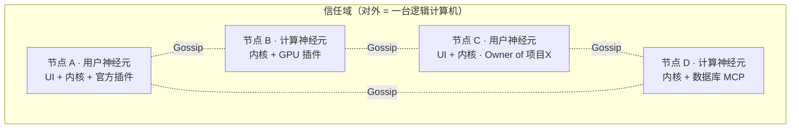
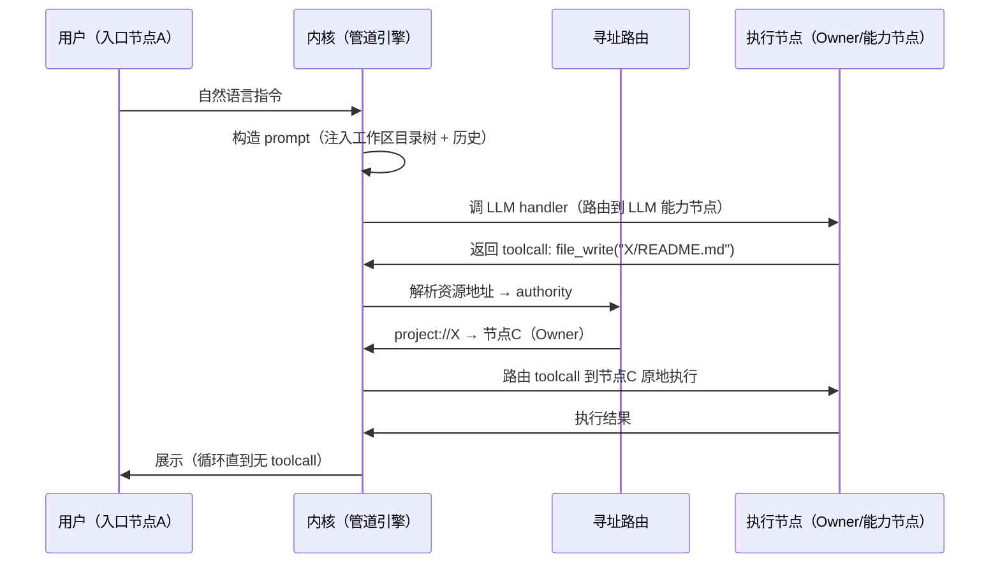

# NeuralSwarm/Code 白皮书 v2.0

**去中心化云 AI IDE**

---

# Part 1 — 产品宣言

## 1. 摘要

NeuralSwarm/Code 是一个**去中心化云 AI IDE**。在任何设备上用自然语言指挥 AI，操作你任何机器上的项目——无需同步代码、无需配置环境。

"Swarm" 代表无数神经元节点组成的去中心化 AI 编码网络。每个安装 NeuralSwarm 的机器都是一个平权节点，节点之间自动发现、按需路由，没有中心服务器，没有单点故障。

核心机制：

| 机制 | 说明 |
|------|------|
| **统一插件原语** | 一切扩展都是"一个 handler 绑定到一个具名的点"。工具、拦截器、上下文源、UI 组件——同一个原语，无特殊通道 |
| **资源寻址路由** | 不靠插件自报标签，靠调用碰到的资源地址推导执行位置。地址解析到哪个节点，活就在哪个节点干 |
| **工作区** | 模型眼里是一个统一的文件树，内核负责把工作区相对路径翻译成"哪个项目、哪个 Owner 节点" |
| **域 = 一台计算机** | 一个信任域对外表现为单一计算机：统一寻址、统一调用，物理分布对插件作者透明 |
| **能力令牌** | 权限跟项目走，不以账户为中心。跨域协作持令牌进入，受令牌时限与范围约束 |

这不仅仅是又一个 AI 编码助手。这是从"单机工具"到"去中心化 AI 开发网络"的范式转变。

## 2. 动机与背景

### 2.1 现有 AI 编码工具的结构性局限

AI 编码工具在 2025-2026 年蓬勃发展，但在跨设备、跨机器的真实工作场景中暴露出结构性不足：

- **工具绑定本地**：Claude Code、Copilot、Cursor 都是"安装在哪儿就在哪儿干活"。离开这台机器，项目就不可达，AI 就不可用。
- **多设备上下文断裂**：在台式机上调试、在笔记本上开会、在平板上检查进度——三台设备三套独立的 AI 上下文，互不相通。
- **跨机器协作靠 Git 推送**：想要别人（或外包团队）的 AI 帮你改代码？先 push，等对方 pull，改完再 push 回来。AI 没有被纳入协作流，它只是一个本地工具。

### 2.2 设计哲学

**项目原地驻留** — 项目文件只存在于 Owner 节点。AI 过去干活，代码不过来。这里的"过去干活"有精确含义：不是整个 agent 搬过去，而是 **toolcall 这个最小执行单元，按它碰到的工作区路径，被逐次路由到对应 Owner 原地执行**。

**逻辑透明，而非物理透明** — 我们统一的是寻址和调用的语义，让整个域看起来像一台计算机；我们**绝不**假装性能和可靠性也统一。远程调用有延迟、节点会下线——这些事实诚实地暴露，不用谎言掩盖。

**统一插件原语** — 内核极简，不实现任何 AI 逻辑。所有功能——工具、并发控制、记忆、Spec 注入、UI 面板——都是"绑在某个具名点上的 handler"，通过同一套机制接入。

**声明必须可验证** — 任何注册声明，内核必须能机械地验证或推导。插件只声明两件内核查得了的事：绑在哪个点、handler 入口怎么连。路由、亲和性、状态位置，全部从可观察的资源地址推导，不靠插件自报的盲标签。

**能力令牌安全模型** — 权限跟项目走，不以账户为中心。跨域协作持令牌进入对方信任域，被强制使用该域的插件与行为，受令牌的范围与时限约束。没有隐式的超级管理员。

## 3. 它解决的两个痛点

### 3.1 多设备上下文断裂 → 一套共享上下文

同属一个信任域的设备（台式机、笔记本、家里的电脑），其工作区、插件、记忆、对话历史全部通过 Gossip 在域内广播同步。在任意设备打开 NeuralSwarm，看到的是同一套项目列表、同一套已装插件、同一份对话历史。换设备就是换一块屏幕，不需要重新配置、不需要 git push、不需要重装插件。

安装一个插件 = 域内广播，全域生效。删除一条记忆 = 域内广播，全域清除。域，就是一台逻辑计算机。

### 3.2 跨机协作靠 Git 推送 → 持令牌进域，原地执行

你给外包团队签发一张能力令牌（"只允许改 docs/ 目录，限 4 小时"）。外包方持令牌接入**你的**信任域，被强制使用你域的插件和行为方式，对你的项目 Owner 节点原地操作——不需要 push，不需要 pull，AI 直接被纳入协作流。令牌过期，访问自动终止。令牌泄露，也只波及那一个项目。

我们取代的不是 Claude Code。我们取代的是远程桌面连回公司电脑、给外包开 VPN 访问内网、用 U 盘拷代码去另一台机器这些原始操作。

## 4. 竞品对比

| 维度 | Claude Code | Copilot / Cursor | Codespaces | **NeuralSwarm** |
|------|-------------|------------------|------------|-----------------|
| **项目可达性** | 仅本机 | 仅本机 | 云端虚拟机 | **网络中任意节点** |
| **执行位置** | 本地 | 本地 | GitHub 云端 | **项目 Owner 原地执行** |
| **架构** | 单机 CLI | 单机插件 | 中心化容器 | **去中心化 P2P 网络** |
| **多设备连续** | 上下文断裂 | 上下文断裂 | 需建新 Codespace | **域内同步，任意入口继续** |
| **代码同步** | 不需要（单机） | 不需要（单机） | git push/pull | **不需要（原地执行）** |
| **协作模型** | 无 | 无 | 共享 Codespace | **能力令牌持令进域** |
| **离线能力** | 不可用 | 不可用 | 不可用 | **单节点完全离线** |
| **扩展性** | MCP 工具 | 插件 | DevContainer | **统一 handler-绑点 + 三档 transport** |
| **富文本渲染** | 终端受限 | 编辑器内 | 编辑器内 | **原生 Markdown / diff / 可视化** |

**适用场景**：一个人固定一台机器写代码 → Claude Code / Cursor；需要隔离的云端环境 → Codespaces；**多设备无缝切换、远程操作家里/公司开发机、外包团队 AI 协作但不交源码、开源项目 AI 协作 → NeuralSwarm**。

我们不是 Claude Code 的 MCP 插件，而是独立 IDE。正因如此，反而能向后兼容整个 MCP 生态——MCP server 作为一档 transport 接入（见附录）。它们做网络/工具层，我们做 IDE 层。

---

# Part 2 — 技术架构

## 5. 系统全景与网络拓扑

每个节点平权。带 UI 的称**用户神经元**，不带 UI 的称**计算神经元**。网络通过 Gossip 自动发现节点、同步域级状态。



一次指令的流动：在任意入口节点输入 → 内核构造 prompt → 调 LLM → LLM 吐 toolcall → 内核按 toolcall 碰到的资源地址路由到对应节点原地执行 → 结果喂回循环。



节点内部分层：**UI 层（可选）** → **内核（六机制，必选）** → **插件（native/gRPC/MCP 三档）**。详见第 6–13 章。

## 6. 核心抽象：handler 绑点

整个系统只有一个扩展原语：

> **一个 handler 绑定到一个具名的点。流到达这个点时，handler 被调用，拿到在途数据，可以返回数据影响流向。**

过去被当成不同"种类"的扩展，机械层面其实是同一件事——区别只在点叫什么名字、到达时数据长什么样：

| 传统认知 | 机械本质 |
|---------|---------|
| 工具（Tool/MCP） | 流到达 `tool:file_read` 点 → handler 收到参数 → 返回结果 |
| 拦截器（Hook） | 流到达 `tool-execute.before` 点 → handler 收到在途数据 → 改写/放行/阻断 |
| 上下文源（记忆/Spec） | 流到达 `llm-prompt` 点 → handler 贡献一段上下文片段 |
| UI 组件 | 流到达 `ui:dialog` 点 → handler 渲染，可回传决策 |

四类坍缩成一类。这正是"管道是唯一扩展点，没有特殊通道，没有特权接口"。

**点的词汇表是固定的小集合**：管道阶段（`user-message` / `llm-prompt` / `llm-response` / `tool-execute` / `tool-result`）、`tool:*`、`ui:*`、`lifecycle:*`。插件只能往**已有种类的点**上挂 handler，**不能发明新的扩展点**——这是"声明必须可验证"在结构层的落地，防止扩展点无序膨胀。

## 7. 资源寻址与路由

**路由不靠声明，靠推导。** 一个 handler 该在哪个节点执行，由这次调用涉及的**资源地址**决定，而不是插件自报的 `affinity` / `stateful` 之类标签。

每次调用，内核计算涉及的资源地址集合 = 调用载荷里的地址 ∪ handler 注册时声明绑定的资源 ∪ 上下文相对地址（如 `self`、当前 UI 会话）。把每个地址解析到它所属的权威节点（authority）：

- 解析到唯一节点 → 路由到那里。
- 没有任何节点绑定（如 `web_search` 只碰开放互联网）→ 自由路由，在注册了它的节点间做负载均衡。

| 调用 | 涉及的资源地址 | 推导出的路由 |
|------|------------|------------|
| `file_read` 项目文件 | `project://X/...` → Owner | 路由到 Owner，原地读 |
| `web_search` | 无节点绑定资源 | 任意注册节点，负载均衡 |
| `db_query`（连接池） | `node://server-db/pool` | 钉在 server-db |
| 并发 hook | `project://X/.snapshot` → Owner | 与 file_write 同节点，天然无竞争 |
| 冲突 UI | `ui://session-abc` → 入口 | 钉在正在渲染的入口节点 |

**由此逼出一条铁律：凡是需要路由连续性的东西，必须可寻址。** 连接池、会话、缓存、UI 会话——都得是内核能解析到某节点的地址。不可寻址 = 不可路由，这是构造上的真，不是祈祷。对比"`stateful: true`"这种标签——它根本说不清是哪个实例，地址法则诚实得多。

**节点抖动与故障转移**：路由表由 consistent hash 在各节点本地独立计算（输入是存活节点列表，输出一致，零网络传输）。每个能力有 primary/backup，primary 调用失败立即切 backup，同时 Gossip 报告疑似下线。节点下线/上线 → hash ring 重算，自动重新分配，不广播询问"谁有空"。

**节点本地状态挂了怎么办**，同样从 authority 推导，不需新声明：派生状态（缓存、索引）源头还在 → 换节点重算；外部连接（数据库池）别的节点 reach 得到 → 在那重建；本机物理绑定（inotify watcher、本机设备）authority 唯一 → 无法迁移，诚实报"该能力在 N 上，N 不可达"，绝不假装 failover。

## 8. 工作区模型

模型（AI agent）眼里的世界是一个**工作区**——一组挂载在一起的文件夹，它以为自己在统一文件系统里操作。它发出的 toolcall 用工作区相对路径（`read("website/README.md")`），符合 OpenAI/Anthropic schema，参数里**没有任何节点信息**。

内核负责翻译。工作区是一张映射表：

```
工作区（全域同步的用户定义状态）
  website/*          → 项目 Y → Owner: node-desktop
  neuralswarm-core/* → 项目 X → Owner: node-server
```

收到 `read("website/README.md")` → 查映射，`website/` 前缀属于项目 Y → Owner 是 node-desktop → 路由到 node-desktop 原地执行。**资源地址不是 toolcall 自带的，是内核用工作区上下文算出来的。**

**默认值堵死歧义**：toolcall 路径参数有默认值，缺省即"当前工作目录/当前挂载"，单权威、零歧义。模型想访问当前主机工作区外的东西，必须**显式**传主机名等限定条件。

**工作区是双层的，但只有一层是真实体**：全域工作区是一份持久的挂载配置，域内 Gossip 同步，换设备就在；会话工作区不是独立实体，是全域工作区的一个**子集视图**（这次任务只关心哪几个挂载），纯内存过滤集，不持久、不同步。地址解析永远只查那份全域映射。

跨节点拷贝/对比/聚合这类"一次调用碰两个 Owner"是伪命题——模型只会分两次单权威调用，不存在跨节点单调用。

## 9. 域 = 一台计算机

把整个信任域视为一台计算机，是"到处运行"的关键。但目标必须精确：**统一的只能是寻址和调用的语义（逻辑透明），永远不要去统一性能和可靠性（物理透明是分布式系统的头号谎言）。**

由此，三个看似棘手的问题：

**分化**（不同节点装的插件不同）= 这台计算机"装了哪些软件"。能力 = 全域能力的并集，路由表把"谁提供"对调用者藏起来。全域都没有 → `command not found`，诚实报错 + 提示去市场装。

**对称性破缺**（GPU/CPU、Owner/非Owner）= 这台计算机内部的**硬件专业化**。一台单机内部本就破缺——CPU、GPU、磁盘各司其职。破缺不该消除，该被路由层当成调度依据去利用。**路由层就是这台域计算机的 OS 调度器。**

**影响内部交互**（同节点交互是本地的、跨节点变网络的）才是真命门，两条纪律覆盖：
- **松耦合协作 → 一律走点/管道，禁止插件直接互调。** 插件只写"我处理这个点的流"，上下游在哪它不关心，引擎负责跨节点搬运。如同 `grep | sort`，grep 不知道 sort 在哪，哪怕 sort 在另一台机器代码也一行不改。**管道吸收 local/remote 差异，插件作者写单机心智。**
- **紧耦合协作 → 因 bind 同一资源而自动共址。** 并发 hook 与 file_write 都碰 `project://X`，authority 相同 → 被路由到同一节点 → 交互自动变回本地、同步、可靠。**对称破缺被资源亲和性重新对齐，不靠声明，靠地址。**

一句话：**路由层 = OS 调度器（利用硬件破缺），管道 = IPC（吸收 local/remote），资源地址 = 统一虚拟地址空间。** 你不是在消除破缺，你是在给它一个 OS。

**域级共享状态**（记忆、工作区配置、插件清单、对话历史）通过 Gossip 广播 + 版本向量收敛，每个节点本地持有一份（SQLite）。节点全部重启后，各自读本地状态，Gossip 交换版本向量，取最高版本，版本相同则 LWW（时间戳最新/节点 ID 最大）收敛。删除也是广播事件，全域清除。

## 10. 内核：六个机制

内核坍缩成六个机制，全是骨架和契约，**零 AI 逻辑、零具体工具、零 LLM 实现**——这些全是 handler：

| 机制 | 职责 |
|------|------|
| **点注册表** | 系统有哪些具名的点、每个点挂了哪些 handler。唯一的扩展契约。点的种类固定，插件不能发明新点 |
| **管道引擎** | 流经过点时按 before/after 拓扑序调用 handler，统一 invoke 语义（给 ctx，拿回 ctx）。agent 循环（toolcall 没完就回到 llm-prompt、LLM 不再要工具就终止）是这里的控制流 |
| **传输适配** | native / gRPC / MCP 统一成可 invoke 的对象。调用方不感知 transport |
| **寻址路由** | 工作区映射、资源地址 → authority、consistent hash + primary/backup |
| **域成员与 Gossip** | 节点发现、心跳、域级共享状态的版本向量收敛 |
| **令牌闸门** | 调用前校验令牌对「点 + 资源地址」的授权 |

**Agent 循环归内核，但只是控制流骨架**：循环本身是内核的，循环里每一步"做什么"全是 handler。内核含控制流，不含智能。智能在挂于 `llm-prompt` 点的 LLM handler 和其他 handler 里。

## 11. 插件体系

**取消"核心/次核心"分层。** 只有"官方维护"和"社区维护"的区别，机制上零差异，走同一条注册流程，官方插件没有任何后门。

**Transport 是 handler 的正交维度，不是种类。** 注册契约统一，传输实现可以分化：

| Transport | 用于 | 特征 |
|-----------|------|------|
| **native** | 官方插件（标准库） | 进程内/官方签名动态库，零序列化，每节点自带 |
| **gRPC** | 社区插件 | 跨进程/跨节点，装在特定节点 |
| **MCP** | 外部工具生态 | stdio/SSE，第三方 MCP server，`tools/list` 暴露的工具被当成 `tool:*` 点上的 handler |

管道引擎一律只见"点上的一个可调用 handler"，不关心它怎么连。gRPC 只用在真正该用的地方（跨节点、第三方），官方高频插件走 native，零开销。

**官方插件（标准库）的具体设计见独立文档《官方插件设计》。** 按离最小链路的距离分两档（实现优先级，非架构特权）：

- **最小核三件**（骨架 + 它们 = 跑通"对话 + 改代码"）：朴素 LLM 调用（挂 `llm-prompt`→`llm-response`，对接一个模型端点，**非**融合 LLM）、基础工具（`file_read`/`file_write`/`shell`）、聊天面板。
- **标准库其余**（逐个加）：记忆、Spec 注入、并发控制、文件树/工作区视图、冲突弹窗、令牌授权确认、状态栏。后期再加提交/Review 插件。

**融合 LLM 是升级版，明确后置**：多 provider 网关、fallback、跨节点 LLM 调度属高级调度。妙在它与朴素 LLM 调用挂在同一个点上，将来平滑替换，agent 闭环一行不改。

**Planner / Explorer 不是独立插件**：它们是 agent 循环用 LLM + 基础工具实现的编排行为，不立独立插件。多 Agent 调度器同理后置——默认串行不调度，需要时它是社区插件。

## 12. 安全模型：信任域 + 能力令牌

| 概念 | 说明 |
|------|------|
| **信任域** | 一组互相信任的节点（一个人的设备集群或一个团队）。域内交互自动放行，工作区/插件/记忆/历史全域 Gossip 同步 |
| **能力令牌** | 权限跟项目走。令牌直接声明"对哪些点、哪些资源地址、什么范围、多长时限"的授权，不以账户为中心 |
| **跨域 = 持令牌进域** | 外包方持令牌接入你的域，被强制使用你域的插件与行为，受令牌范围/时限约束。没有隐式超级管理员 |

令牌与资源寻址天生契合——令牌本质就是"对 `点 + 资源地址` 的访问授权"，由第 10 章的令牌闸门在每次调用前校验。

**`.neuralswarm/` 目录**（项目内，随项目走）：

```
project/
├── .neuralswarm/
│   ├── config.yml      # 项目归属声明（Owner、项目标识）
│   ├── tokens.json     # 本项目签发的能力令牌（不提交 Git）
│   └── spec/           # Spec 插件的项目规范（可选）
├── src/
└── ...
```

各插件自行管理存储位置：Spec 插件可能用 `.neuralswarm/spec/`，记忆插件可能用 `.neuralswarm/memory/`，但这是插件的选择，不是内核的规定。令牌由项目 Owner 签发，存 `tokens.json`，不提交 Git。令牌泄露只波及单个项目。

为什么不是 RBAC：去中心化系统里没有"超级管理员"。每个项目 Owner 就是自己项目的管理员，令牌把安全边界缩小到单个项目——令牌泄露只影响一个项目，不会波及其他。不同项目不同令牌，互不相干。

## 13. UI 架构：插槽 = UI 的点

UI 与后端用同一套哲学，是后端的镜像：

| | 后端 | 前端 |
|---|------|------|
| 内核提供 | agent 循环（控制流骨架） | 骨架屏 shell（布局 + 插槽位置 + 动态加载 + loading 占位） |
| 插件提供 | 挂在点上的 handler | 挂在插槽上的组件 |
| 扩展点词汇表 | 固定：pipe/tool/ui/lifecycle | 固定：聊天主区/侧边栏/工具栏/状态栏/对话框 |
| 铁律 | 插件不能发明新点 | 插件不能发明新插槽 |

**骨架屏归内核**（UI 的控制流），UI 插件只往固定插槽填组件。同一插槽可挂 0~N 个组件、按 before/after 排序，但**组件内部不再开放子插槽**——一旦允许嵌套，就是在 Vue 之上重造一套组件树，那正是要避免的"造 Vue"。约束换简单性，与后端一致。

**样式契约**：内核暴露 design tokens（颜色、间距、字号，沿用现有《前端设计规范》的 CSS 变量体系）+ 基础组件库，插件只能用内核给的 token 和组件拼，视觉自然统一，不许自带样式系统。具体插槽清单与 UI 插件契约见《插件接口设计》，官方 UI 组件设计见《官方插件设计》。

## 14. 部署形态与 Git 关系

| 模式 | 适用场景 | 节点数 |
|------|---------|--------|
| 单神经元 | 个人开发，所有项目在本地，行为如普通 AI 编码工具，但随时可扩展 | 1 |
| 单域多节点 | 小团队、家庭多设备 | 2~10 |
| 多域联邦 | 企业 + 外包、开源社区，跨域持令牌协作 | 10+ |

**与 Git 的关系**：Git 管历史，NeuralSwarm 管位置。AI 可以 commit，但提交/Review 走插件（后期）。Git 记录版本历史，NeuralSwarm 决定 AI 在哪台机器上操作代码；提交插件自动生成 commit message，Review 插件拦截未 review 的修改、监控 review 率——这两个是后期的官方插件，设计见《官方插件设计》。

## 15. 演进路线

| 阶段 | 内容 | 交付物 |
|------|------|--------|
| **MVP·核心骨架** | 六机制内核最小可用形态 + 朴素 LLM + 基础 toolcall + 聊天 UI + 单节点工作区 | 单机上对话、AI 读写文件跑命令（详见《验收标准/MVP-核心骨架与单节点闭环》） |
| **网络层** | libp2p 节点发现 + Gossip + 资源寻址路由 + 工作区域内同步 | 两台机器组域，从一台操作另一台的项目 |
| **融合 LLM** | 多 provider 网关、fallback、跨节点 LLM 调度（升级版） | 模型能力按负载/GPU 在域内择优 |
| **安全与跨域** | 信任域、能力令牌签发/校验/过期、跨域持令牌进入 | 外包持令牌操作指定项目，过期自动终止 |
| **生态与移动端** | 插件市场、移动端壳、Web 直连、社区插件 | 手机指挥家里开发机，社区插件开箱即用 |

## 16. 结语

NeuralSwarm/Code 不替代 Claude Code、Cursor、Copilot，不替代 Codespaces、GitPod，不是 Agent 框架，不是 Git 替代品。

它是一个去中心化的神经元网络。每台机器是一个节点，一个信任域对外是一台逻辑计算机：统一寻址、统一调用，物理分布透明。内核只是骨架——一个分布式的、点驱动的管道引擎，带寻址路由和域同步；所有能力都是绑在点上的 handler。

内核 + 官方插件以 Apache 2.0 协议开源。社区可自由提交插件到插件市场。

---

## 附录：MCP 的定位

MCP 不是核心传输协议，而是 transport 三档之一——它跟"插件是什么"正交。一个 MCP server 是一个说 MCP 话的进程，内核对它 `tools/list` 一问，得到的工具被当成 `tool:*` 点上的 handler 原生吞下去。MCP 常见的有状态（连接池、会话）恰恰只有在会话可寻址时才路由得对——这与第 7 章的资源寻址法则一致。

| 旧定位（v0.8/v1.0） | 新定位（v2.0） |
|-------------------|---------------|
| 核心传输层，Client ↔ Server 的唯一通道 | transport 三档之一，与 native/gRPC 平级 |
| 架构图的中心 | 一种接入方式，被统一插件原语吸收 |
