# NeuralSwarm/Code 白皮书 v1.0

**去中心化云 AI IDE**

---

# Part 1 — 产品宣言

## 1. 摘要

NeuralSwarm/Code 是一个**去中心化云 AI IDE**。在任何设备上用自然语言指挥 AI，操作你任何机器上的项目——无需同步代码、无需配置环境。

"Swarm" 代表无数神经元节点组成的去中心化 AI 编码网络。每个安装 NeuralSwarm 的机器都是一个平权节点，节点之间自动发现、按需路由，没有中心服务器，没有单点故障。

核心机制：

| 机制 | 说明 |
|------|------|
| **神经元节点** | 每台机器都是一个完整的 AI 编码环境，可选择加载 UI 成为用户入口 |
| **任务路由** | 在任何节点发出指令，网络自动找到项目所在机器，原地执行 |
| **融合 LLM** | 作为核心插件提供标准 LLM Provider 接口，对接外部模型网关 |
| **管道插件** | 内核提供命名管道，所有功能——包括融合 LLM、三角色——都由插件注册处理器协同完成 |
| **能力令牌** | 权限跟项目走，不以账户为中心，实现去中心化安全协作 |

这不仅仅是又一个 AI 编码助手。这是从"单机工具"到"去中心化 AI 开发网络"的范式转变。

## 2. 动机与背景

### 2.1 现有 AI 编码工具的结构性局限

AI 编码工具在 2025-2026 年蓬勃发展，但在跨设备、跨机器的真实工作场景中暴露出结构性不足：

- **工具绑定本地**：Claude Code、Copilot、Cursor 都是"安装在哪儿就在哪儿干活"。离开这台机器，项目就不可达，AI 就不可用。
- **多设备上下文断裂**：在台式机上调试、在笔记本上开会、在平板上检查进度——三台设备三套独立的 AI 上下文，互不相通。
- **跨机器协作靠 Git 推送**：想要别人（或外包团队）的 AI 帮你改代码？先 push，等对方 pull，改完再 push 回来。AI 没有被纳入协作流，它只是一个本地工具。

### 2.2 设计哲学

**项目原地驻留** — 项目文件只存在于 Owner 节点。AI 过去干活，代码不过来。

**神经元对等网络** — 没有 Master 节点，没有中心服务器。节点平等，自动发现，按需路由。

**自然语言遥控** — 在任何设备的聊天界面输入指令，AI 自动路由到正确的位置执行。

**插件可组合** — 内核极简，不实现任何 AI 逻辑。所有功能——并发控制、记忆、Spec 注入、全局聊天——都是插件，通过管道引擎协同。

**能力令牌安全模型** — 权限跟项目走，不以账户为中心。跨域协作需显式授权，没有隐式的超级管理员。

## 3. 系统架构

### 3.1 网络拓扑

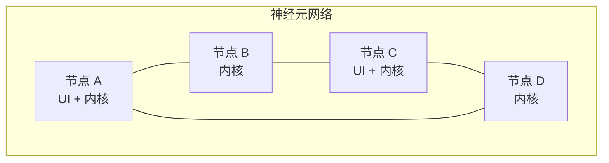

每个节点平权。带 UI 的称为**用户神经元**，不带 UI 的称为**计算神经元**。网络通过 Gossip 协议自动发现新节点。

### 3.2 单节点内部结构

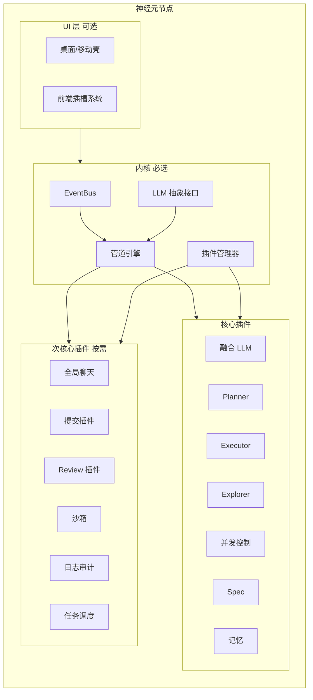

### 3.3 组件层级

| 层级 | 包含 | 特征 |
|------|------|------|
| **内核** | EventBus、管道引擎、插件管理器、LLM 抽象接口 | 不可移除。不实现任何 AI 逻辑，只提供骨架和契约 |
| **核心插件** | 融合 LLM、Planner、Executor、Explorer、并发控制、Spec、记忆 | 去掉就基本不能干活。但技术上可替换 |
| **次核心插件** | 全局聊天、提交插件、Review 插件、沙箱、日志审计、任务调度 | 增强体验和质量保障，不装也能写代码 |

**判断标准**：卸载一个组件，系统是否还能完成"用户输入 → AI 改代码"这条基本链路？能 → 插件。不能 → 内核。

### 3.4 内核组件

| 组件 | 职责 | 类比 |
|------|------|------|
| EventBus | 节点内部及跨节点事件路由 | 神经系统 |
| LLM 抽象接口 | 定义统一的 `chat()` 调用契约，不实现 | 接口规范 |
| 管道引擎 | 命名管道 + 拓扑排序执行插件 | Unix pipeline |
| 插件管理器 | 加载/卸载/热更新插件 | 包管理器 |

### 3.5 任务路由流

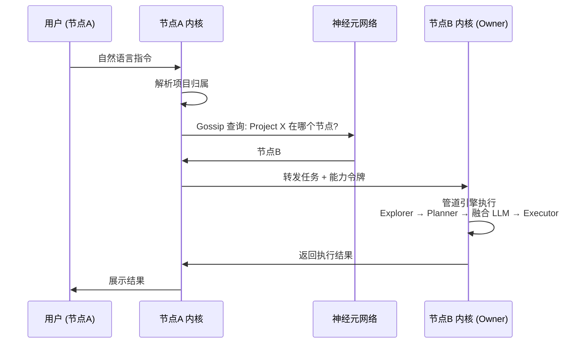

- 项目文件始终只在 Owner 节点本地操作
- 转发的是**任务指令**，不是代码
- 用户入口节点与执行节点可以是同一台（单机模式），也可以是不同机器（远程模式）

## 4. 竞品对比

### 4.1 对比矩阵

| 维度 | Claude Code | OpenClaw | Codespaces | **NeuralSwarm** |
|------|-------------|----------|------------|-----------------|
| **项目可达性** | 仅本机 | 仅本机 | 云端虚拟机 | **网络中任意节点** |
| **执行位置** | 本地 | 本地 | GitHub 云端 | **项目 Owner 节点原地执行** |
| **架构** | 单机 CLI | 单机聊天 | 中心化容器 | **去中心化 P2P 网络** |
| **多设备连续** | 上下文断裂 | 上下文断裂 | 需建新 Codespace | **任意入口继续对话** |
| **代码同步** | 不需要（单机） | 不需要（单机） | git push/pull | **不需要（原地执行）** |
| **协作模型** | 无 | 无 | 共享 Codespace | **能力令牌跨域授权** |
| **离线能力** | 不可用 | 不可用 | 不可用 | **单节点完全离线** |
| **扩展性** | MCP 工具 | 插件 | DevContainer | **管道插件体系** |

### 4.2 适用场景

| 场景 | 推荐工具 |
|------|---------|
| 一个人在固定电脑上写代码 | Claude Code / Cursor |
| 需要在多台设备间无缝切换 | **NeuralSwarm** |
| 需要远程操作家里/公司的开发机 | **NeuralSwarm** |
| 需要外包团队 AI 协作但不给源码 | **NeuralSwarm** |
| 需要一个隔离的云端开发环境 | Codespaces |
| 开源项目的 AI 编码协作 | **NeuralSwarm** |

### 4.3 独立 IDE 的战略意义

与上述竞品不同，NeuralSwarm 不是 Claude Code 的 MCP 插件。它是一个**独立的 IDE**。这意味着：

**渲染能力**：CLI 工具链无法渲染富文本——diff 只能靠终端颜色，Markdown 只能看源码。NeuralSwarm 的聊天界面原生支持 Markdown 渲染、diff 高亮、可视化对比。这是所有寄生在 CLI 上的 MCP 插件无法跨越的天花板。

**MCP 生态兼容**：正因为是独立 IDE，NeuralSwarm 反而可以**向后兼容整个 MCP 生态**。OpenTentacle 的 P2P 发现、DarkMatter 的信任评分、Agent P2P 的代币质押——这些 MCP Server 可以直接接入 NeuralSwarm 的管道，作为插件运行。它们做网络层，我们做 IDE 层，不冲突。

我们取代的不是 Claude Code。我们取代的是远程桌面连回公司电脑、给外包开 VPN 访问内网、用 U 盘拷代码去另一台机器这些原始操作。

---

# Part 2 — 技术设计

## 5. 融合 LLM 与角色分工

### 5.1 核心原则

内核不实现任何 LLM 逻辑。内核只提供 LLM 抽象接口 + 管道引擎。融合 LLM 和三角色都是**核心插件**，各自独立，通过管道协同。

### 5.2 插件关系

```
内核管道
  │
  ├── Planner 插件   (拆解步骤)
  ├── Executor 插件  (生成代码、调用工具)
  ├── Explorer 插件  (检索上下文、理解代码)
  └── 融合 LLM 插件  (标准 LLM Provider，对接外部模型网关)
```

四个插件各自独立注册到管道。谁也**不调用**谁，谁也**不包装**谁。就像 Unix——每个插件只做一件事。

### 5.3 各插件职责

| 插件 | 只做一件事 | 输入 | 输出 |
|------|-----------|------|------|
| **融合 LLM** | 实现 LLM 抽象接口，对接外部模型网关 | prompt | response |
| **Planner** | 理解用户意图，拆解为执行步骤 | 用户消息 + 上下文 | 步骤列表 |
| **Executor** | 生成代码，调用工具，执行步骤 | 步骤 + prompt | 工具调用结果 |
| **Explorer** | 搜索项目上下文，理解代码结构 | 任务描述 | 相关上下文片段 |

### 5.4 组合是管道的活

```
user-message 管道:
  Explorer 读取上下文 → Planner 拆解 → 融合 LLM 调用模型 → Executor 执行工具
```

这不是融合 LLM 的能力，是管道引擎拓扑排序执行插件的结果。换个项目、换个场景，管道可以走完全不同的插件组合。

### 5.5 调度由插件负责

融合 LLM 内部不包含调度逻辑。如果需要更复杂的任务调度（DAG 拆解、优先级排队、失败重试），由**任务调度插件**（次核心插件）按需提供。内核默认模式下，任务串行执行，不调度。

## 6. 项目生态与并发控制

### 6.1 项目唯一性与任务路由

一个项目只存在于一个 Owner 节点。项目归属通过 Gossip 协议随节点发现自动传播——"项目 X 在我这儿"这条信息不需要中心化注册。

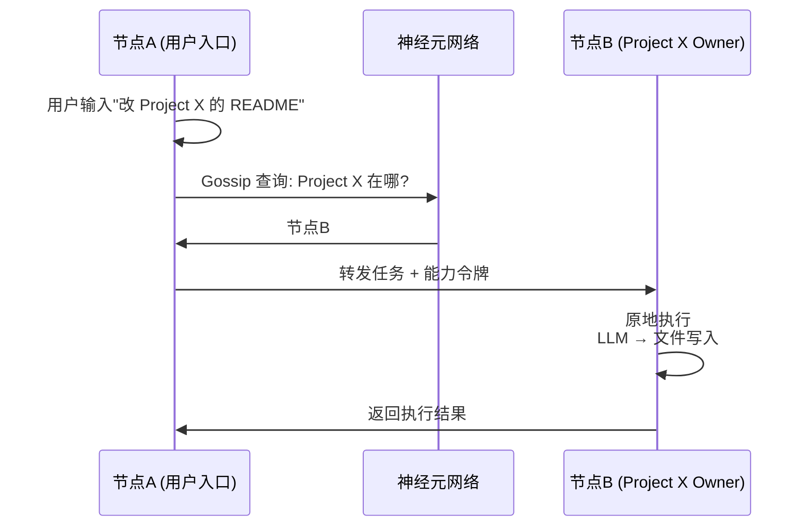

### 6.2 并发控制

并发控制是**一个核心插件**。注册到 `tool-execute` 管道，拦截文件写入。

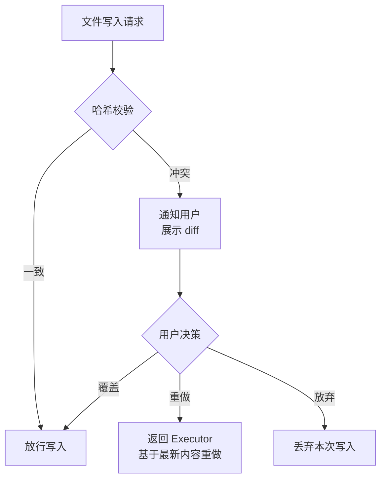

不自动重试，不自动合并，不设超时。并发插件的唯一职责是**发现问题 → 通知用户 → 执行用户决策**。

### 6.3 `.neuralswarm/` 目录

```
project/
├── .neuralswarm/
│   ├── config.yml        # 项目归属声明
│   └── tokens.json       # 本项目签发的能力令牌（不提交 Git）
├── src/
└── ...
```

各插件自行管理存储位置。Spec 插件可能使用 `.neuralswarm/spec/`，记忆插件可能使用 `.neuralswarm/memory/`，但这是插件的选择，不是内核的规定。

## 7. 插件管道协同

### 7.1 管道即骨架

内核不做事，内核只提供管道。所有功能逻辑由插件注册到管道节点上执行。

```
user-message → llm-prompt → llm-response → tool-execute → tool-result
     │              │              │              │              │
     ▼              ▼              ▼              ▼              ▼
  Explorer      Planner       Executor      并发插件       日志插件
  注入上下文     拆解步骤      解析工具调用    冲突检测       记录审计
```

5 个管道节点，插件挂在任意节点上。挂的人多了，用拓扑排序决定先后。

### 7.2 插件注册

```yaml
# 并发插件声明
plugin: concurrency-control
hooks:
  - pipe: tool-execute
    handler: check_conflict
    before: [file-write]
  - pipe: tool-result
    handler: update_snapshot
    after: [tool-execute]
```

`before` / `after` 声明顺序依赖，框架负责拓扑排序。循环依赖 → 加载时报错，拒绝启动。

未声明 `before`/`after` 的插件，按注册先后执行。规则：**先排有依赖关系的，再按注册顺序排无依赖的**。确定性的，可预期的。

### 7.3 执行模型

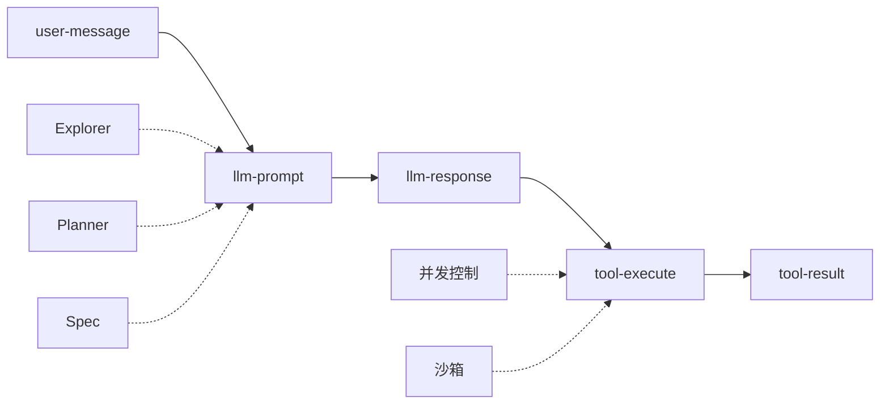

每个管道节点可以有 0～N 个处理器。拓扑排序后的执行顺序是确定性的。

### 7.4 管道是唯一扩展点

所有功能——Spec 注入、记忆、并发、全局聊天——都通过同样的管道机制接入。没有特殊通道，没有特权接口。一个插件能做的事，另一个插件也能做。

## 8. 安全模型：信任域 + 能力令牌

### 8.1 三个核心概念

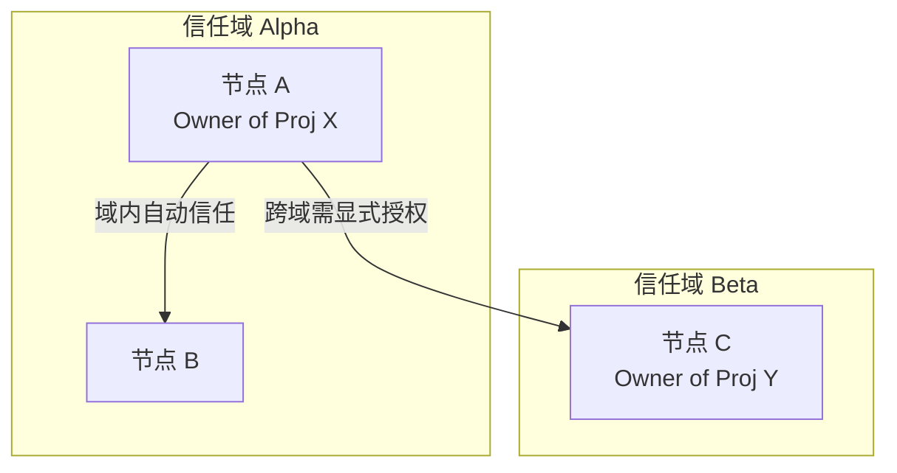

| 概念 | 说明 |
|------|------|
| **信任域** | 一组互相信任的节点。域内交互自动放行，跨域交互需用户显式授权 |
| **能力令牌** | 权限跟项目走。令牌写明了"谁能对哪个项目做什么"，不以账户为中心 |
| **显式授权** | 跨域请求弹到用户面前，用户点同意才放行。没有隐式授权，没有静默通过 |

### 8.2 能力令牌

```json
{
  "token_id": "tok-abc123",
  "project": "neural-swarm",
  "granted_to": "domain:beta",
  "capabilities": ["file_read", "file_write", "shell"],
  "constraints": {
    "paths": ["src/**", "docs/**"],
    "max_duration": "4h"
  },
  "expires_at": "2026-07-07T00:00:00Z"
}
```

令牌由项目 Owner 签发，写在 `.neuralswarm/tokens.json` 里，不提交 Git。

### 8.3 为什么不是 RBAC

| RBAC | 能力令牌 |
|------|---------|
| 中心化账户系统 | 无账户，令牌跟项目走 |
| 角色 = 权限集合 | 令牌直接声明能力 |
| 需要管理员分配角色 | Owner 自己签发令牌 |
| 跨项目需要统一身份 | 不同项目不同令牌，互不相干 |

去中心化系统里，没有"超级管理员"。每个项目 Owner 就是自己项目的管理员。能力令牌把安全边界缩小到单个项目——令牌泄露只影响一个项目，不会波及其他。

### 8.4 跨域授权流程

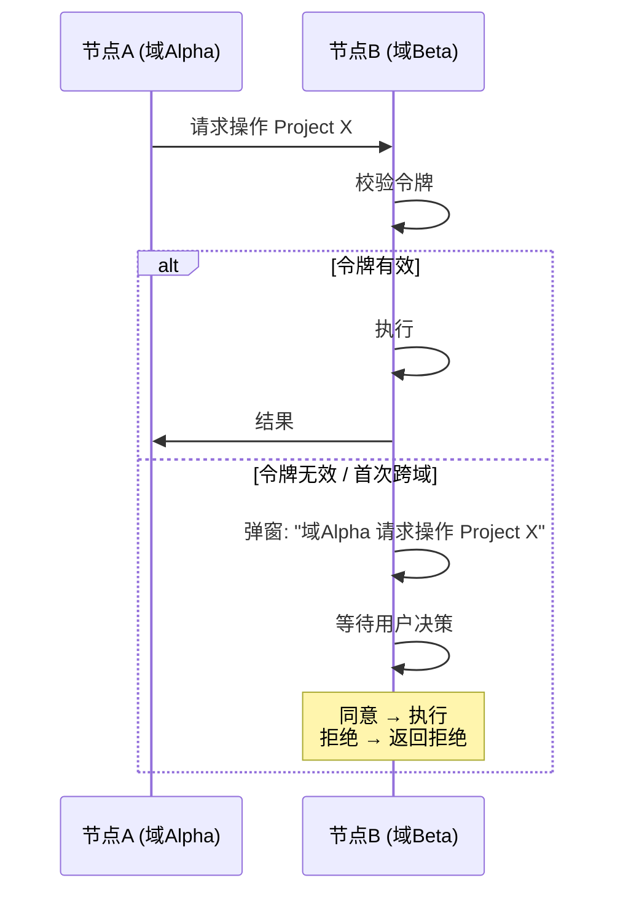

## 9. 核心插件体系

以下三个都是**核心插件**。内核不包含 Spec、不包含记忆、不包含全局聊天。不装 = 没有这功能。

### 9.1 Spec 插件

在 `llm-prompt` 管道中注入项目规范，让 LLM 按项目约定干活。

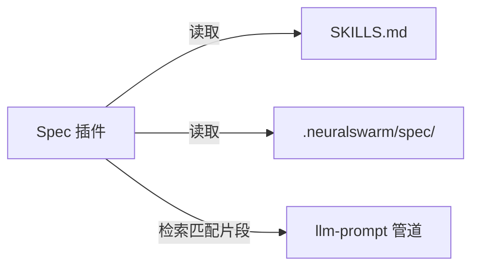

| 特性 | 说明 |
|------|------|
| 规范来源 | `SKILLS.md`、`.neuralswarm/spec/`、项目根 `spec/` |
| 注入时机 | `llm-prompt` 管道，排在 Explorer 之后 |
| 注入方式 | 检索相关片段注入 System Prompt，不全量塞入 |
| 版本联动 | 跟随 Git 分支——切分支自动切 Spec |

### 9.2 记忆插件

提供 `/remember` 命令，按需记住用户指定的信息。下次对话时自动注入摘要。

不是四层认知架构。不是 L0-L3。不是 RAG 向量库。就是一个**带标签的便签本**。

| 特性 | 说明 |
|------|------|
| 存什么 | 用户手动 `/remember` 的内容 |
| 怎么存 | 本地文件，纯文本/Markdown |
| 怎么用 | 下次对话开始时，检索相关记忆注入上下文 |
| 不存什么 | 不自动记录、不自动整理、不自动提升层级 |

```yaml
# 记忆存储示例
- tag: neural-swarm-architecture
  content: "融合 LLM 是插件不是内核，三角色各自独立..."
  created: 2026-06-30
```

自动记忆 = 自动污染。让用户决定什么值得记住。

### 9.3 全局聊天插件

一个无项目绑定的独立聊天会话。

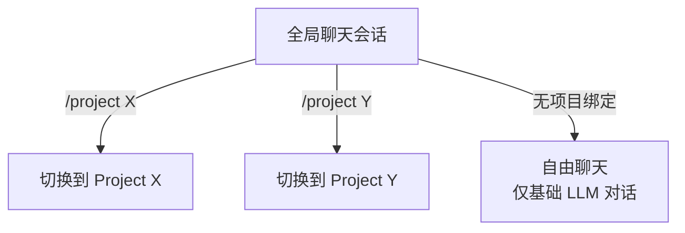

全局聊天就是一个**不挂项目的普通 LLM 对话**。用户可以手动切到任意项目，切过去就是项目模式，切回来就是自由聊天。不跨项目派发，没有独立 Spec 和记忆。

## 10. 前端插槽与动态 UI

### 10.1 核心原则

UI 只提供聊天骨架。所有功能面板由插件动态加载。

桌面端（Tauri 壳）、移动端（原生壳）、浏览器——三种入口，**同一套 Web UI + 同一套插槽系统**。插件写一次，所有端都能用。

### 10.2 固定插槽

| 插槽 | 位置 | 可被哪个插件占用 |
|------|------|----------------|
| 侧边栏 | 聊天区左侧 | 文件树、项目列表、记忆面板 |
| 工具栏 | 聊天区顶部 | 模型选择器、项目切换器 |
| 对话框 | 模态弹窗 | 冲突解决 diff 视图、令牌授权确认 |
| 状态栏 | 窗口底部 | 当前项目、连接状态、节点信息 |

### 10.3 插件声明

```json
{
  "plugin": "concurrency-control",
  "slots": {
    "dialog": {
      "component": "ConflictResolver",
      "events": ["tool-execute.conflict"]
    }
  }
}
```

插件声明自己要哪个插槽、提供什么组件、监听什么事件。

### 10.4 动态加载

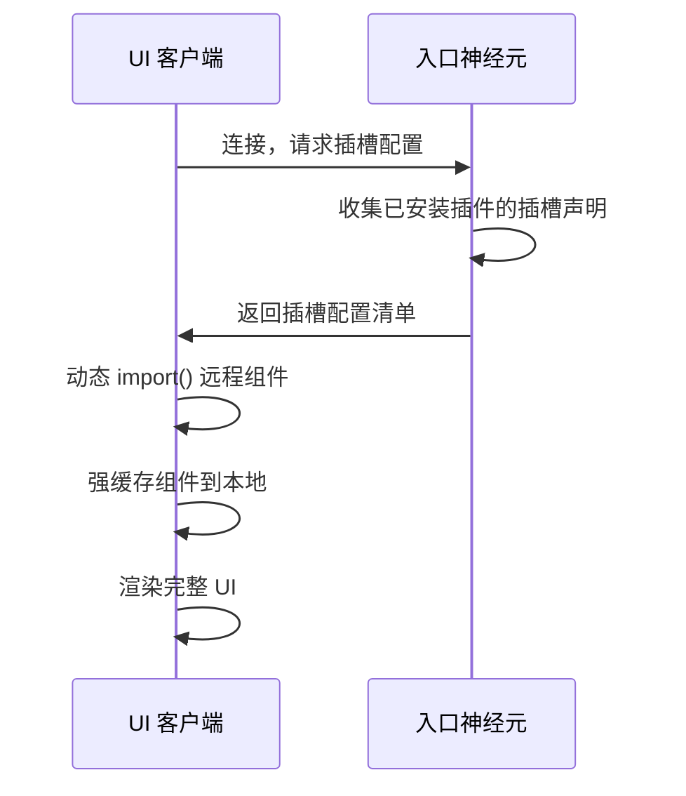

- **远程组件**：插件作者提供组件 URL，启动时动态加载
- **强缓存**：加载后缓存到本地，下次启动秒开
- **纯 Web 客户端**：`https://<任意节点>:port` 打开浏览器就是完整 UI，不需要安装

## 11. 部署与运维

### 11.1 两种部署模式

**单神经元模式（个人开发机）**：

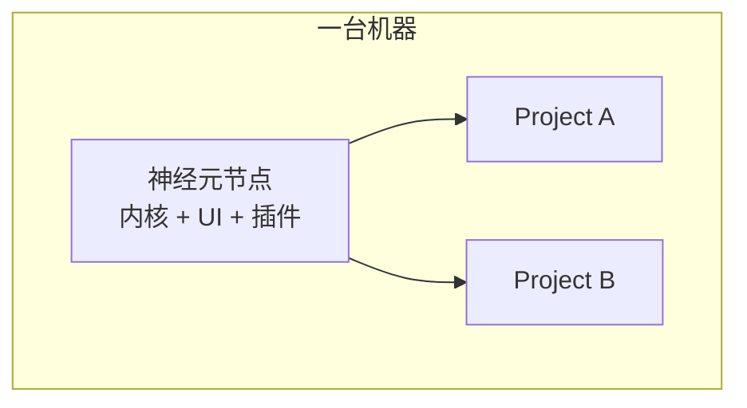

一个人，一台机器，所有项目在本地。行为和普通 AI 编码工具一样——但随时可以扩展为多节点。

**多神经元集群（团队/企业）**：

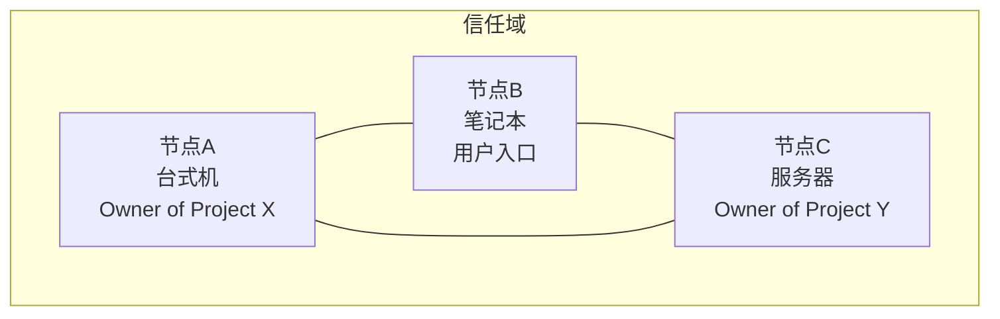

| 模式 | 适用场景 | 节点数 |
|------|---------|--------|
| 单神经元 | 个人开发 | 1 |
| 单域多节点 | 小团队、家庭多设备 | 2~10 |
| 多域联邦 | 企业 + 外包、开源社区 | 10+ |

### 11.2 与 Git 的关系

Git 管历史，NeuralSwarm 管位置。AI 可以 commit，但 review 是必须过的门。

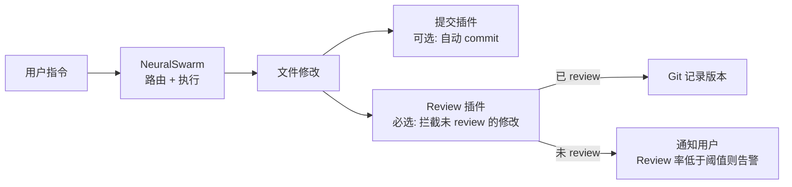

| 组件 | 说明 |
|------|------|
| Git | 记录版本历史 |
| NeuralSwarm | 决定 AI 在哪台机器上操作代码 |
| 提交插件（次核心） | AI 自动生成 commit message 并提交 |
| Review 插件（次核心） | 拦截未 review 的修改，确保 review 率 |

AI 改完代码 → 提交插件 commit → Review 插件拦在最后。没 review 的修改堆积到一定数量，Review 插件告警甚至拒绝后续 AI 操作，直到用户补上 review。

## 12. 里程碑路线图

### Phase 1：单节点可运行

| 组件 | 层级 | 内容 |
|------|------|------|
| 内核 | 内核 | EventBus、管道引擎、插件管理器、LLM 抽象接口 |
| 聊天界面 | — | 基础聊天 UI + 前端插槽骨架 |
| 融合 LLM 插件 | 核心 | 对接外部模型网关，标准 Provider |
| Executor 插件 | 核心 | 基本代码生成 + 工具调用 |
| 插件框架 | 内核 | 加载、注册、管道挂载、拓扑排序 |

**交付物**：在单台机器上，打开 UI，对话，AI 能读文件、写代码。

### Phase 2：多节点网络

| 组件 | 层级 | 内容 |
|------|------|------|
| 节点发现 | 内核 | Gossip 协议，自动感知域内节点 |
| 项目路由 | 内核 | 查询归属 → 转发任务 → 结果返回 |
| 能力令牌 | 核心 | 令牌签发、校验、过期管理 |
| Planner 插件 | 核心 | 任务拆解 |
| Explorer 插件 | 核心 | 上下文检索 |
| 并发控制插件 | 核心 | 文件哈希冲突检测与通知 |
| Spec 插件 | 核心 | 项目规范注入 |
| 记忆插件 | 核心 | `/remember` 命令 + 上下文注入 |
| 全局聊天插件 | 次核心 | 独立无项目绑定聊天会话 |

**交付物**：两台机器组成一个小域，在一台上操作另一台上的项目。

### Phase 3：跨域安全与企业

| 组件 | 层级 | 内容 |
|------|------|------|
| 信任域 UI | — | 域管理、跨域授权确认界面 |
| 企业集成 | — | OIDC 对接（可选，非必须） |
| 插件同步 | — | 域内插件版本同步工具 |
| Review 插件 | 次核心 | Review 率监控、未 review 拦截 |
| 提交插件 | 次核心 | 自动生成 commit message |
| 沙箱插件 | 次核心 | 高风险工具调用的安全隔离 |

**交付物**：两个域之间安全协作，外包团队拿到令牌才能操作指定项目。

### Phase 4：生态与移动端

| 组件 | 层级 | 内容 |
|------|------|------|
| 插件市场 | — | 社区提交、审核、一键安装 |
| 移动端壳 | — | 手机/平板原生壳加载同一套 Web UI + 插槽 |
| Web 直连 | — | 浏览器打开 `https://<节点>:port` = 完整 UI |
| 高级分布特性 | — | 跨地域中继、离线队列同步 |

**交付物**：手机上指挥家里的开发机改代码，社区插件开箱即用。

## 13. 结语

NeuralSwarm/Code 不是又一个 AI 编码助手，不替代 Claude Code、Cursor、Copilot。不是中心化云 IDE，不替代 Codespaces、GitPod。不是 Agent 框架，没有 Agent 概念，没有调度器。不是 Git 替代品。

它是一个去中心化的神经元网络。每台机器是一个节点，每个节点能接受指令、路由任务、原地执行。

内核 + 核心插件以 Apache 2.0 协议开源。社区可自由提交插件到插件市场。

---

## 附录：MCP 远程文件代理（未来可选）

MCP 不再是核心协议。在极端场景下——比如需要 AI 操作一台**无法安装 NeuralSwarm 节点**的设备（嵌入式开发板、受限服务器）——可通过 MCP 插件将该设备的文件系统暴露给最近的神经元节点，由该节点代为执行。

| 旧 v0.8 定位 | 新 v1.0 定位 |
|-------------|-------------|
| 核心传输层，Client ↔ Server 的唯一通道 | 可选插件，未来按需实现 |
| 架构图的中心 | 附录的一小段 |
