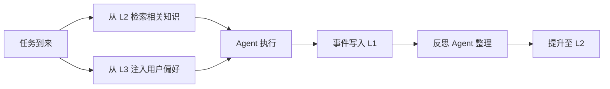

# M5: 认知

**目标**：Agent 具备多层记忆能力，事件驱动协作。

**可见产出**：Agent 能记住之前的对话和项目知识，新任务自动注入相关记忆。

**并行轨道**：
- Track A（服务器）：多层记忆 + 事件总线
- Track C（UI）：记忆状态展示

---

## 阶段 5.1 多层记忆系统

**目标**：实现 L0-L3 四层记忆，支持记忆的读写和自动流转。

**验收任务**：
- [ ] **L0 瞬时记忆**（Agent 上下文）：
  - 存储于 PostgreSQL（Agent.context 字段），Redis 作为快速缓存
  - Agent 重启时从 PostgreSQL 恢复上下文
  - 自动 compact（基于 API 返回的 token 消耗）
- [ ] **L1 情景记忆**（项目事件流）：
  - 存储于 PostgreSQL（ProjectMemory, level=L1）
  - 带 TTL（默认 24 小时），过期自动清理
  - 同时写入 Redis Streams 用于实时订阅
  - 记录格式：`{"event": "tool_call", "agent": "agent-01", "detail": "...", "timestamp": "..."}`
- [ ] **L2 语义记忆**（长期知识）：
  - 存储于 PostgreSQL（ProjectMemory, level=L2）
  - 永久保存
  - 由反思 Agent 异步整理 L0 + L1 生成
  - 向量化存储（embedding）
- [ ] **L3 过程性记忆**（用户偏好）：
  - 存储于 PostgreSQL（GlobalMemory）
  - 永久保存，全局作用域
  - 在任务开始时静默注入 Agent 的 System Prompt
- [ ] 记忆 API：
  - `GET /api/memory/{project_id}?level=L1` — 查询记忆
  - `POST /api/memory/{project_id}` — 手动写入记忆
- [ ] 单元测试覆盖

**记忆流转**：


**验收实践**：
```python
# 1. L0 持久化测试
agent = Agent(id="test", ...)
await agent.execute("任务 A")
context_after = agent.context  # 保存到 PostgreSQL

# 重启 Agent
agent2 = Agent(id="test", ...)
assert agent2.context == context_after  # 从 PostgreSQL 恢复

# 2. L1 事件流测试
await agent.execute("修改了 src/main.py")
# 预期：L1 中记录了事件

# 3. L2 整理测试
# 等待反思 Agent 执行
# 预期：L2 中生成了长期知识

# 4. L3 偏好注入测试
# 用户偏好："代码风格：简洁，不要多余注释"
# 预期：新 Agent 的 System Prompt 中包含此偏好
```

---

## 阶段 5.2 事件总线

**目标**：基于 Redis Streams 的事件发布/订阅，支持 Agent 间异步协作。

**验收任务**：
- [ ] Redis Streams 连接和管理
- [ ] 发布/订阅模式：
  - Agent 发布事件到 stream
  - 其他 Agent 订阅感兴趣的事件
- [ ] 事件类型定义：
  - `file:changed` — 文件变更
  - `task:completed` — 任务完成
  - `conflict:detected` — 冲突检测
  - `conflict:resolved` — 冲突解决
  - `memory:updated` — 记忆更新
- [ ] 事件路由（根据事件类型分发到对应消费者）
- [ ] 消费者组管理（多个 Agent 可组成消费者组）
- [ ] 单元测试覆盖

**验收实践**：
```python
# 1. 发布事件
await event_bus.publish("file:changed", {
    "file": "src/main.py",
    "agent_id": "agent-01",
    "change_type": "modified"
})

# 2. 订阅事件
events = await event_bus.subscribe("file:changed", consumer_group="reviewers")
# 预期：收到事件

# 3. 跨 Agent 协作
# Agent A 修改文件 → 发布 file:changed 事件
# Agent B（代码审查）订阅 → 自动触发审查
```

---

## 阶段 5.3 UI 记忆展示

**目标**：UI 展示 Agent 的记忆状态。

**验收任务**：
- [ ] 记忆面板（按层级展示 L0-L3）
- [ ] L1 事件流时间线（类似 Git log）
- [ ] L2 知识列表（搜索、查看）
- [ ] L3 偏好设置界面
- [ ] 记忆注入可视化（任务开始时显示注入了哪些记忆）

---

## M5 集成验证

```bash
# 1. 提交任务 A："创建一个 Python 项目结构"
# 预期：Agent 执行，L1 记录事件

# 2. 等待反思 Agent 整理
# 预期：L2 生成知识 "项目使用 FastAPI + SQLAlchemy"

# 3. 提交任务 B："给项目添加用户认证"
# 预期：
#   - Agent 从 L2 检索到 "项目使用 FastAPI + SQLAlchemy"
#   - 从 L3 检索到用户偏好
#   - 自动注入到上下文
#   - Agent 基于已有知识执行任务
```

**M5 完成标志**：Agent 有记忆能力，新任务自动注入相关记忆，事件驱动协作可用。
