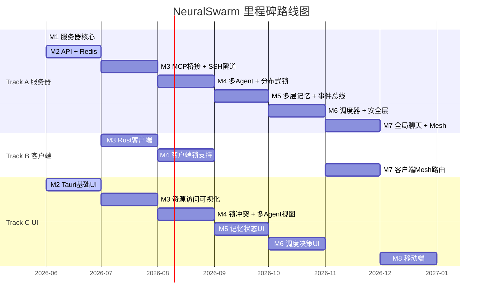

# NeuralSwarm/Code 验收标准

> 每个里程碑是三条轨道的集成点，而非串行阶段。
>
> 参考文档：
> - [白皮书](../白皮书.md) — 系统设计和功能定义
> - [技术架构选型](../技术架构选型.md) — 技术栈和开发路径
> - [总体设计](../superpowers/specs/2026-06-06-overall-design.md) — 里程碑和阶段划分

## 目录结构约定

```
neuralswarm-code/
├── server/          # Python/FastAPI 服务器（Track A）
├── client/          # Vue 前端（三端共用：桌面、Web、移动端）（Track C）
├── core/            # Rust 客户端 Core（桌面、移动端复用）
├── desktop/         # Tauri 壳（复用 client/ + core/）（Track C）
├── mobile/          # 移动端原生壳（复用 client/ + core/）（M8）
├── docker/          # Docker Compose 部署配置
└── docs/            # 文档
```

## 三轨并行架构



## 里程碑总览

| 里程碑 | 主题 | 可见产出 | 详情 |
|--------|------|----------|------|
| [M1](M1.md) | 服务器核心 | 可启动的 FastAPI 服务器 | ✅ 已完成 |
| [M2](M2.md) | MVP | 桌面应用能提交任务、看到 Agent 对话 | ✅ 已完成 |
| [M3](M3.md) | 资源访问 | Agent 能操作本地文件 | ✅ 已完成 |
| [M4](M4.md) | 并发 | 多 Agent 同时工作、锁冲突弹窗 | 当前阶段 |
| [M5](M5.md) | 认知 | Agent 记住上下文、跨任务记忆 | |
| [M6](M6.md) | 调度 + 安全 | 智能任务分配、RBAC 权限 | |
| [M7](M7.md) | 高级功能 | 全局聊天、跨服务器资源访问 | |
| [M8](M8.md) | 移动端 | 手机上也能用 | |
